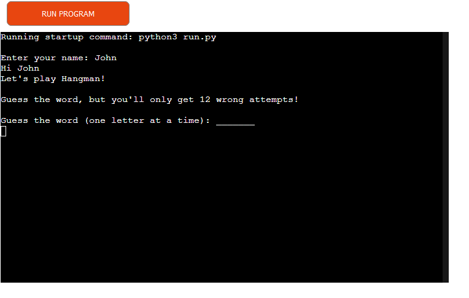
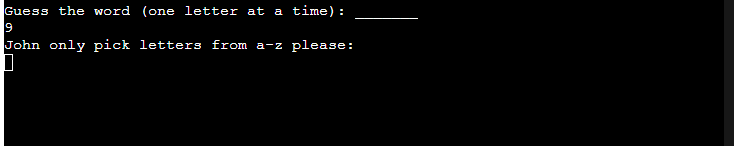
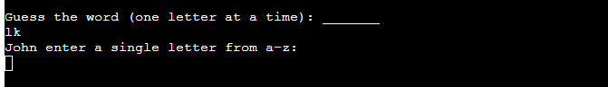
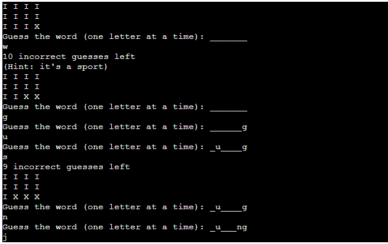
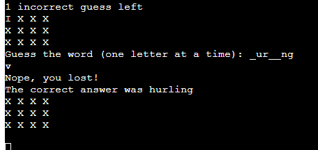
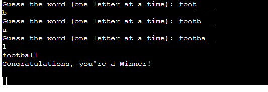

# Hangman

This is a simple game based on the classic Hangman.  It is a Python terminal game which runs in the Code Institute mock terminal on Heroku.

The player has to guess the word randomly picked from the list in the code.  They have 12 incorrect attempts before they lose.

The live link can be found here - https://john-byrne-hangman.herokuapp.com/ 

## How to play 

Simply try to guess the word by entering letters.

A correct guess will enter the letter in the relevant position in the word, with unknown (to the player) letters represented a a series of underscores "_".  If the letter appears more than once, all appearances will show when it is correctly guessed.

the game will end when either the player correctly guesses the word completely, or has made 12 incorrect guesses, whichever comes first.

## Features

### Existing Features

- __Start Screen__

  - To start, the player enters their name and presses enter.  A word is randomly selected from a list in the code, and the basic instructions are given.

  - If anything other than a letter from a-z is chossen, a message telling the player to select such a letter is displayed.

  

  - If more than one letter is picked, the player is asked to pick a single letter.

  

- __Normal gameplay__

  - As the guesses are made, correct ones fill in on the screen, and incorrect ones are counted down.  The number of remaining guesses is given as a number, and represented by an "I", incorrect guesses are represented by an "X".  This was done instead of creating a rudimentary hanging man, as that seemed a little mean.

  - When the player is down to ten incorrect guesses remaining, a hint is given.

- If 12 incorrect guesses are made, the player loses and gets a message to say they lost, and telling them the correct answer.

- If the player guesses all the correct letters before having 12 incorect guesses, they will get the winning screen.

### Features Left to Implement

- Add a larger selection of words.
- Add different themed lists with hints depending on which theme was randomly selected.

## Testing 

I have manually tested this project by doing the following:

- Passed the code through a PEP8 linter
- Deliberately given invalid guesses to check the error messages
- Tested in my local terminal and the Code Institute Heroku terminal

## Bugs

### Solved Bugs

- Initially, when an uppercase letter was entered it gave the error message asking for a letter.  This was overcome by adding the .lower() method.

### Remaining Bugs

- No remaining bugs, all those discovered were fixed

### Validator Testing 

- PEP8
  - Initially, a number of lines were too long, this was fixed by moving comments and using brackets to split the code in the selection list over lines 9 and 10
  - The validator expected two lines between the import and define function lines, so an extra line was added.
  - White space was removed from several locations

## Deployment

The site was deployed using Code Institutes mock terminal for Heroku

- Steps for deployment:
  - The main branch was deployed
  - Create a new Heroku app
  - Add the key and value to the Config Var in the settings
  - Set the buildbacks to Python and NodeJS in that order
  - Link the Heroku app to the repository
  - Click on Deploy Branch

The live link can be found here - https://john-byrne-hangman.herokuapp.com/

  
## Credits 

- Code Institute for the deployment terminal
- The Geeksfor Geeks website for the idea of using a Hangman type game as the project - https://www.geeksforgeeks.org/hangman-game-python/